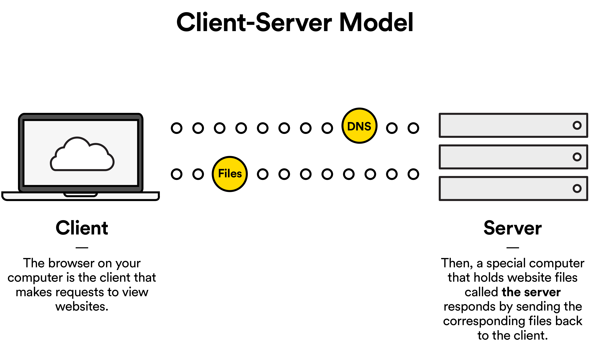

**Fundamentals Unit 1**

---

# Developer Foundations Cheat Sheet

#### Computer Network
* Two or more computers that are connected and can share data.

#### Interconnected Computer Network
* Two or more computer networks that are connected and can share data.

#### The Internet
* A system of interconnected networks that connect billions of computers and devices worldwide.

#### World Wide Web
* An information or data sharing model built on top of a global system of the Internet.

#### HTTP (HyperText Transfer Protocol)
* A system the web follows to transfer data over the Internet.

#### Websites
* Collections of files hosted on a server and accessed through the world wide web.

#### Browsers
* Software used to traverse the Internet and access data on other computers via URLs.

#### URLs (Uniform Resource Locators)
* A name that describes the location of the files that make up a website.

#### Clients
* Personal devices such as computers, phones, or tablets that are used to access the web.

#### Servers
* Used to host the massive amounts of files that make up websites and “serve” files to end users.

#### Client-Server Model

#### Domain Name
* A unique name, tied to an IP Address, that identifies a website.

#### DNS (Domain Name System)
* A directory that stores and helps locate websites via user-friendly domain names

#### IP (Internet Protocol) Addresses
* Unique numeric keys assigned to internet devices and websites.

