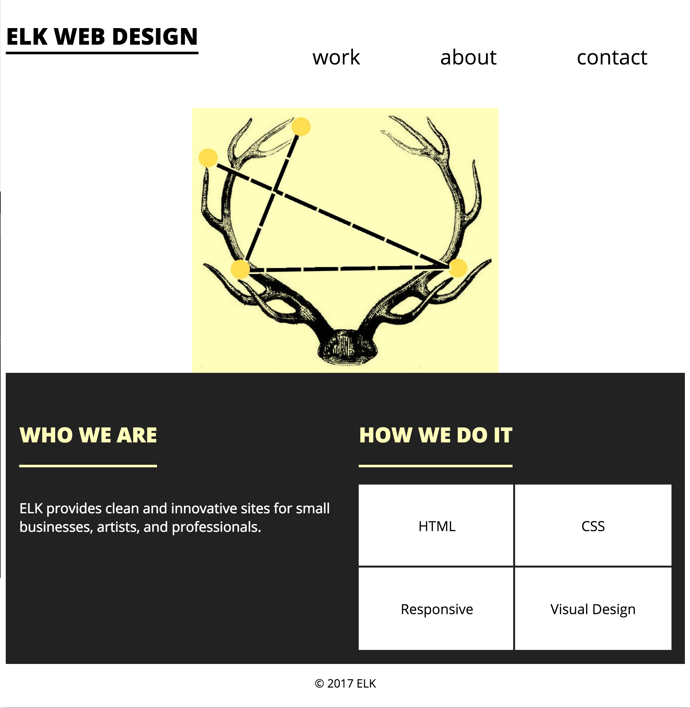
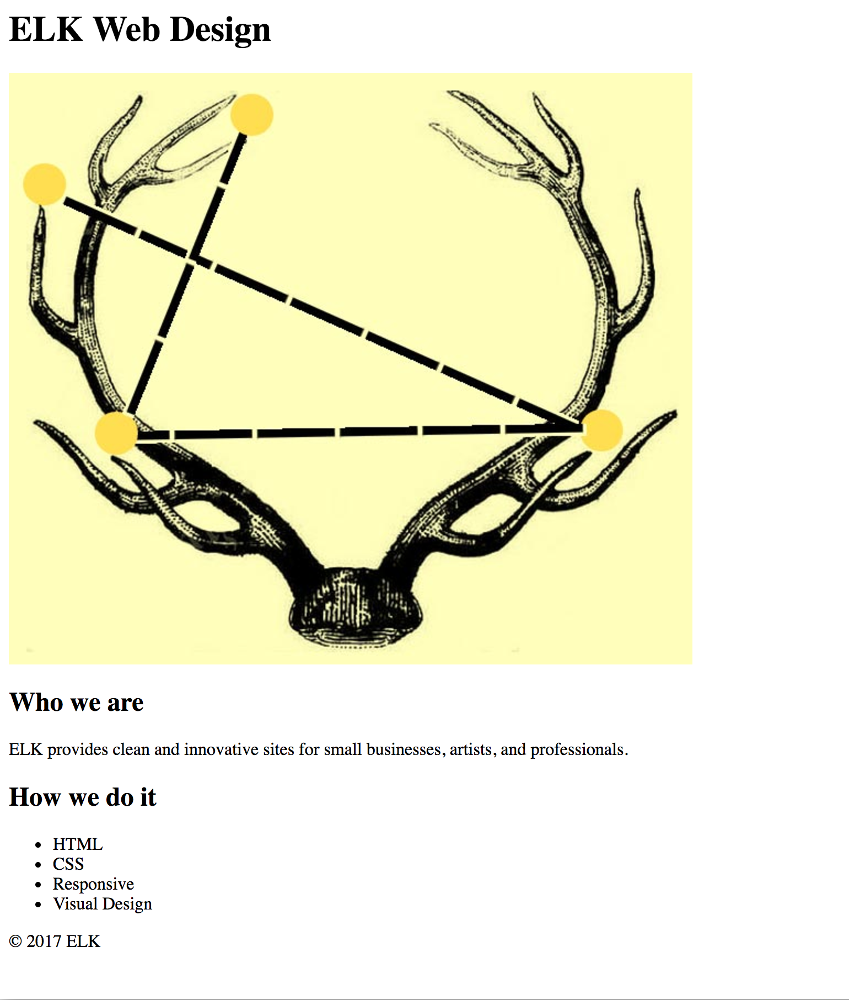

**WDI Fundamentals Unit 5**

---

## Your Turn

### Semantic Elements Exercise

In this exercise, you'll learn the basics of laying out a webpage while building a small business website for ELK Web Design! The final design is based on an assignment submitted by a Front-End Web Development graduate, Lauren Kathe, and looks like this:

This design has four sections:

* Header
* "About" section
* "Services" section
* Footer

This exercise has two sections. First, we'll create the structure of the website. Then, we'll add CSS. 
If you don't see the JS Bin below, please refresh the page.

<a class="jsbin-embed" href="http://jsbin.com/kigeyu/embed?html,css,output">Elk Web Design on jsbin.com</a>

#### Section 1: Content and Page Structure
Your job is to use the notes below to write the HTML for ELK Web Design.

1) **The Header**

ELK Web Design has a `header` element inside the `body` which contains the company name, ELK Web Design, as a level 1 heading, or `h1`. The `header` also contains this image: `http://i.imgur.com/pdsjjxD.jpg`.

2) **The Body**

Inside the `body` there are two sections (or `div`s). One section is for the "About" content, the other for "Services". The section headings are level 2, or `h2`.

_About Content_:

* level 2 heading: Who we are
* paragraph: ELK provides clean and innovative sites for small businesses, artists, and professionals.

_Service Content_:

* level 2 heading: How we do it
* unordered list: HTML, CSS, Responsive, Visual Design

3) **The Footer**
  
paragraph: "&copy; 2017 ELK"

Here's how the page looks without any styling:

#### Section 2: Styling Content

Flip over to your CSS tab.

1) Create a style for the `body`, and set its `font-size` to `18px`. Set the `font-family` to `Arial`.

2) Write a rule for `h1`, and set its `font-size` to `2em`.

3) Create a rule for `h2`, and set its `font-size` to `1.5em`.

4) Use only one `padding` declaration to give `h2` a top and bottom `padding` of `.8em`.

5) Create a rule for both `h1, h2` and set its `text-transform` property to `uppercase`.

6) Let's keep styling both headings. We'll use CSS shorthand to "underline" each one with a `border-bottom`. Give `h1, h2` a `border-bottom` property that's `4px` thick, `solid`, and `black`.

7) Set `h1, h2`'s `display` to `inline-block`.

8) Create a style for images, and set its `display` to `block`.

9) Center all images on the page horizontally by setting `img`s `margin` to `0 auto`.

10) Create a `ul` style, and set its `list-style` to `none`. Set its `margin` to `0` and its `padding` to `0`.

11) Create a `footer` style in your CSS, and center align its text.

12) Set the `footer` `padding` to `1em 0`.

Here's what your webpage should look like in the output now:

All done for now!

> Stuck? Check out the [solutions](../exercise-solutions.md#semantic-elements) for assistance.

---

[On to the next lesson.](div-and-span.md)
